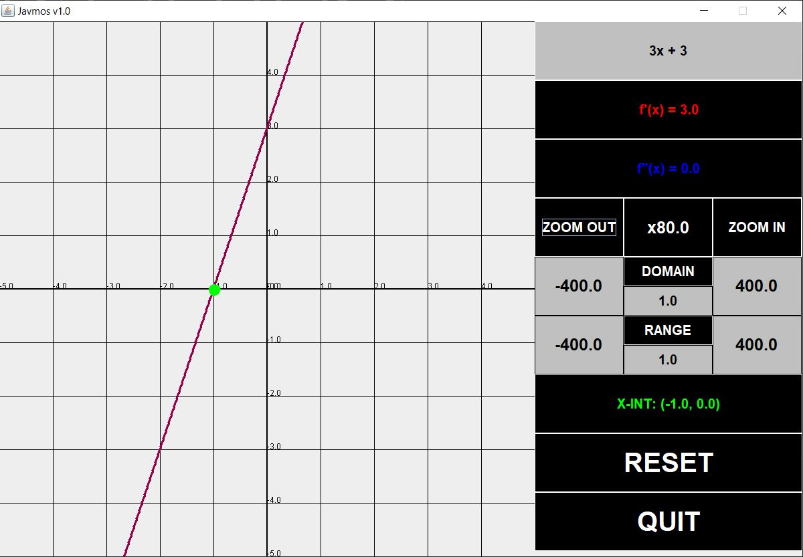
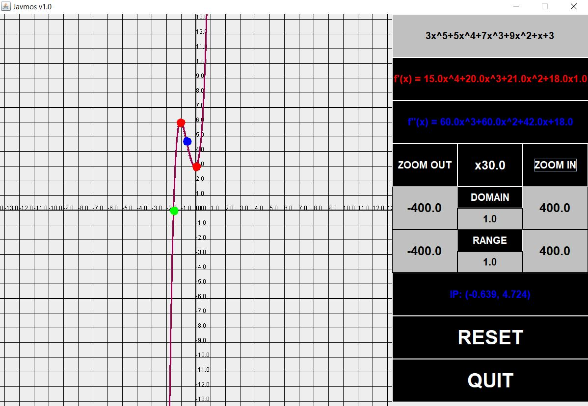
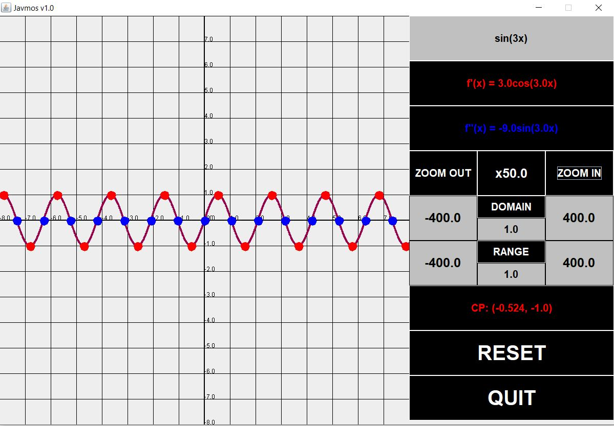
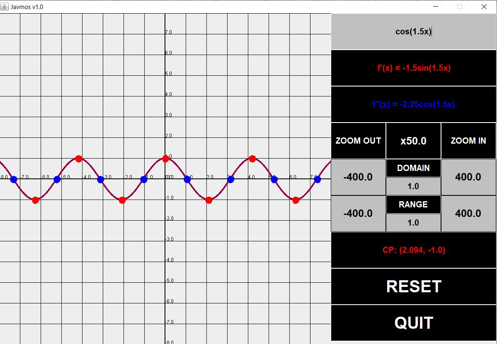
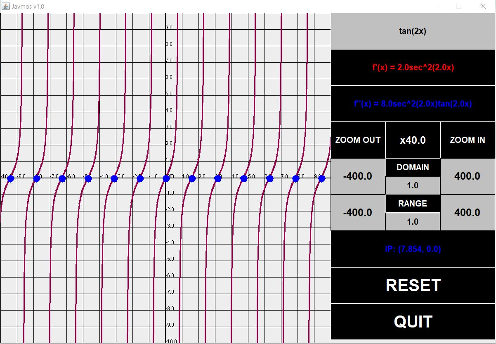

# JavmosGUI
Graphing calculator developed in Java which is capable of graphing and finding critical points of polynomial and trigonometric functions.
This calculator incorporates key object oriented properties such as inheritance and polymorphism. 

# Requirements

* Java Runtime Environment (Build 11.0.1+)
 
# How to use

* Download the executable file 
* Open it once downloaded and play around with polynomial and trigonometric functions!

# Points

**Green Dot**

* Represents x-intercepts

**Red Dot**

* Represents critical points

**Blue Dots**

* Represents inflection points

# Derivatives

* f'(x) represents the first derivative of the function inputted by the user

* f''(x) represents the second derivative of the function inputted by the user

# Polynomial Functions

**Linear function**

**Degree 5 Polynomial**

# Trigonometric Functions

**Sine Function**

**Cosine Function**

**Tangent Function**

